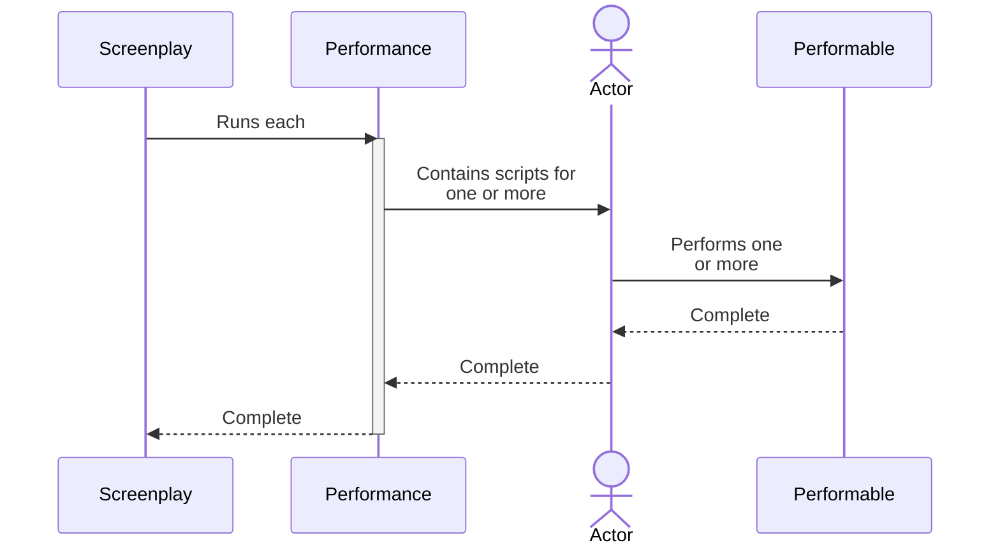

# Top-down look at a screenplay

The diagram below shows a top-down look at a [Screenplay] and how it relates to [Performances], [Actors] and [Performables].
The Screenplay _might itself be controlled by_ a [Test Integration], if Screenplay is being used for automated tests.

The lifetime shown, for the [Performance] also indicates the lifetime of [the dependency injection scope].

[Screenplay]: xref:CSF.Screenplay.Screenplay
[Performances]: xref:CSF.Screenplay.IPerformance
[Actors]: xref:CSF.Screenplay.Actor
[Performables]: ../glossary/Performable.md
[Test Integration]: ../glossary/Integration.md
[Performance]: xref:CSF.Screenplay.IPerformance
[the dependency injection scope]: dependencyInjection/DependencyInjectionScope.md