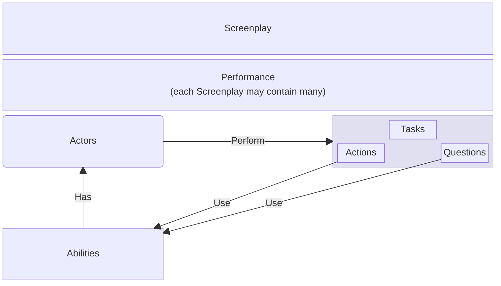

# Makeup of a Screenplay

_A Screenplay_, used as a verb, refers to a complete execution screenplay-based logic, written using this framework.
[`Screenplay`], when used as a noun, is a class which coordinates the scope & execution of that logic.
A Screenplay is comprised or one or more [Performances], usually many.
The diagram below shows the basic building blocks of a performance and how they interact.

[`Screenplay`]: xref:CSF.Screenplay.Screenplay
[Performances]: xref:CSF.Screenplay.IPerformance

## Explanation

A performance involves one or more [Actors].
Each actor usually has at least one [Ability].
The actor performs [Performables], of which there are three fundamental types:

* [Tasks]
* [Actions]
* [Questions]

Actions and questions make direct use of the actor's abilities to perform their work.
Tasks, on the other hand, are compositions of any of actions, questions and/or other tasks.

[A full Screenplay] comprises of one or more performances.

[Actors]: xref:CSF.Screenplay.Actor
[Ability]: ../glossary/Ability.md
[Performables]: ../glossary/Performable.md
[Tasks]: ../glossary/Task.md
[Actions]: ../glossary/Action.md
[Questions]: ../glossary/Question.md
[A full Screenplay]: xref:CSF.Screenplay.Screenplay