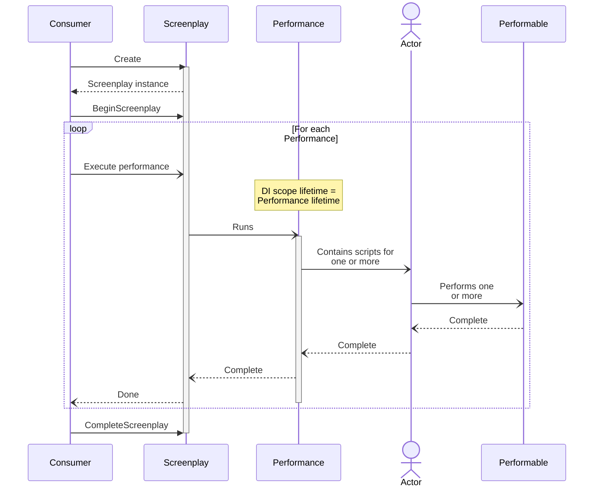

# How Screenplay logic executes

[A Screenplay] is always begun by some consuming logic.
That consuming logic might be [a Test Integration] if Screenplay is being used for automated tests.
The consuming logic might alternatively be hand-written code if Screenplay is being used for process automation and not for testing.

[A Screenplay]: xref:CSF.Screenplay.Screenplay
[a Test Integration]: ../../glossary/Integration.md

## The consuming logic

When using Screenplay for automated testing, the test integration library code _takes care of all the responsibilities of the consuming logic_; developers need only write their tests using Screenplay syntax.
Each test/scenario corresponds to a [Performance].

If Screenplay is not being used for testing, then the consuming logic has the following responsibilities for the use of Screenplay:

1. Create the [`Screenplay`] object using the [`Create`] method
1. Execute [`BeginScreenplay`] before starting the first [Performance]
1. Execute each performance, such as via [`ExecuteAsPerformanceAsync<TPerformance>`] or [`ExecuteAsPerformance`], or one of their overloads
1. Execute [`CompleteScreenplay`] after the last Performance has completed

[Performance]: xref:CSF.Screenplay.IPerformance
[`Screenplay`]: xref:CSF.Screenplay.Screenplay
[`Create`]: xref:CSF.Screenplay.Screenplay.Create(System.Action{Microsoft.Extensions.DependencyInjection.IServiceCollection})
[`BeginScreenplay`]: xref:CSF.Screenplay.Screenplay.BeginScreenplay
[`ExecuteAsPerformanceAsync<TPerformance>`]: xref:CSF.Screenplay.ScreenplayExtensions.ExecuteAsPerformanceAsync``1(CSF.Screenplay.Screenplay,System.Collections.Generic.IList{CSF.Screenplay.Performances.IdentifierAndName},System.Threading.CancellationToken)
[`ExecuteAsPerformance`]: xref:CSF.Screenplay.ScreenplayExtensions.ExecuteAsPerformance(CSF.Screenplay.Screenplay,System.Func{System.IServiceProvider,System.Nullable{System.Boolean}},System.Collections.Generic.IList{CSF.Screenplay.Performances.IdentifierAndName},System.Threading.CancellationToken)
[`CompleteScreenplay`]: xref:CSF.Screenplay.Screenplay.CompleteScreenplay

## Performances & lifetimes

The logic of each [Performance] is executed within its own [dependency injection scope].
The lifetime of this DI scope is matched with the lifetime of the Performance.

The diagram below illustrates the information in this article.
It shows how the consuming logic creates and uses a [`Screenplay`] object and how this relates to [Performances], [Actors] and [Performables].

[dependency injection scope]: ../dependencyInjection/DependencyInjectionScope.md
[Performances]: xref:CSF.Screenplay.IPerformance
[Actors]: xref:CSF.Screenplay.Actor
[Performables]: ../../glossary/Performable.md
