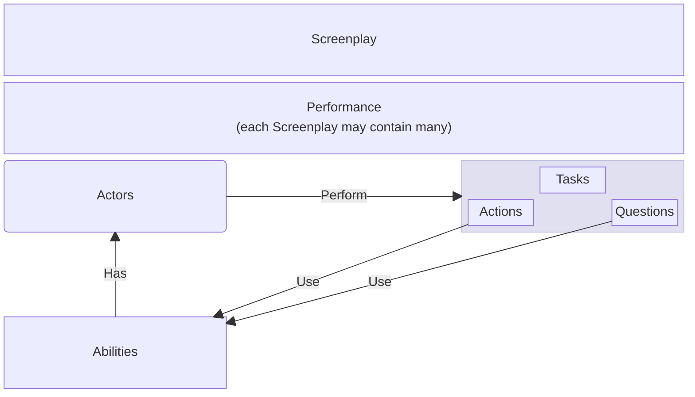

# Makeup of a Screenplay

_A Screenplay_ conceptually refers to a complete execution screenplay-based logic, written using this framework.
As .NET code, [`Screenplay`] is a class which coordinates the scope & execution of that logic.

A Screenplay is comprised at least one [Performance], typically lots of them.
A Performance is made from [Actors] performing [Performables], of which there are [Tasks], [Actions] and [Questions].
The logic of Actions and/or Questions almost always requires the use of an [Ability].
The diagram below shows the architecture of how these concepts relate to one another.

[`Screenplay`]: xref:CSF.Screenplay.Screenplay
[Performance]: xref:CSF.Screenplay.IPerformance
[Actors]: xref:CSF.Screenplay.Actor
[Ability]: ../../glossary/Ability.md
[Performables]: ../../glossary/Performable.md
[Tasks]: ../../glossary/Task.md
[Actions]: ../../glossary/Action.md
[Questions]: ../../glossary/Question.md
