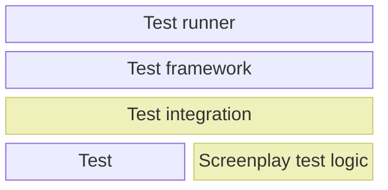

# Screenplay in the testing stack

Screenplay is often used as a tool for writing automated tests.
_It is not a complete testing framework_, though.
It serves as an extension/plugin to existing testing frameworks, enhancing them with Screenplay syntax and logic.

The diagram below shows where Screenplay lies within the technology stack, when it is used as a tool for testing.
The dark yellow/light brown blocks show the Screenplay-specific components.
The explanation below uses [the NUnit test framework] as an example, but this could be substituted for counterparts applicable to any test framework.



[the NUnit test framework]: https://nunit.org

## The test runner

This is the executable tool which runs tests.
Applied to NUnit, this could be [the `nunit3-console.exe` application].

[the `nunit3-console.exe` application]: https://docs.nunit.org/articles/nunit/running-tests/Console-Command-Line.html

## The test framework

All testing framework contain some framework-specific logic of their own, which provide the basis for writing tests.
Applied to NUnit, this is the `NUnit.Framework.dll` which is included in [the NUnit NuGet package].

[the NUnit NuGet package]: https://www.nuget.org/packages/NUnit

## The Test integration

[The Test Integration] is the extension to the test framework (above) which enables the use of Screenplay-based logic in tests.
Each testing framework has its own test integration, as it must be developed for the test framework's syntax and extension points.

[The Test Integration]: ../../glossary/Integration.md

## Tests

The tests are normal tests written for the chosen test framework.
Whilst they might be decorated with additional Screenplay-specific attributes or use Screenplay syntax, they are normal tests in the context of the test framework.

Applied to NUnit, this would be your methods which look similar to:

```csharp
[Test]
public void MyFunctionShouldReturnTrueWhenItIsTuesday()
{
    // Test logic omitted
}
```

## Screenplay test logic

The logic within tests (above) which use Screenplay will be written using Screenplay's test syntax.
That it, it will use [Actors], [Abilities] and [Performables].
In this context, each test is a Screenplay [Performance].

[Actors]: xref:CSF.Screenplay.Actor
[Abilities]: ../../glossary/Ability.md
[Performables]: ../../glossary/Performable.md
[Performance]: xref:CSF.Screenplay.IPerformance