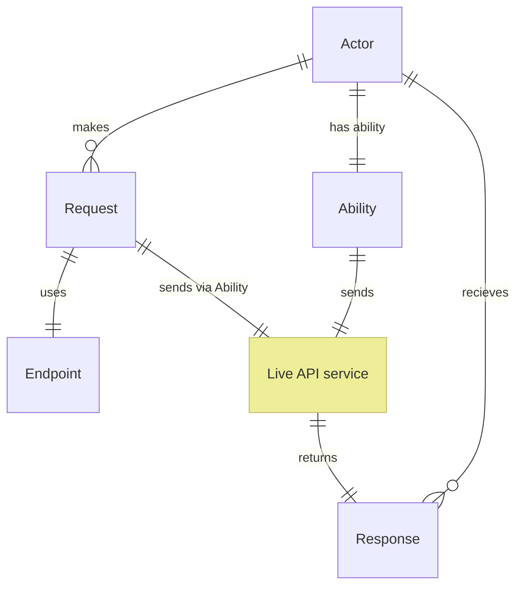

# CSF.Screenplay.WebApis Extension

The Web APIs Extension allows [Actors] to communicate with HTTP web API endpoints within a Screenplay [Performance].

[Actors]: xref:CSF.Screenplay.Actor
[Performance]: xref:CSF.Screenplay.IPerformance
## Overview

The diagram below shows how this extension works.
The concepts of the [Actor] and [Ability] (the ability is named [`MakeWebApiRequests`]) are explained in Screenplay's core documentation.
Other concepts are explained below.
Note that the **Live API service** in this diagram is not a part of Screenplay or this extension.
The Live API service represents an actual  HTTP(S) web server which hosts the API with which Screenplay is communicating.

[Actor]: xref:CSF.Screenplay.Actor
[Ability]: xref:AbilityGlossaryItem
[`MakeWebApiRequests`]: xref:CSF.Screenplay.WebApis.MakeWebApiRequests

This extension provides **[Actions]** which allow the Actor to build and send [HTTP requests] based upon [Endpoint] definitions.
These requests are sent via the HTTP client which is exposed by the [`MakeWebApiRequests`] Ability, to a live API server. 
The server returns an [HTTP Response], which the extension formats into a result object.

[Actions]: ../../../glossary/Action.md
[Endpoint]: Endpoints.md
