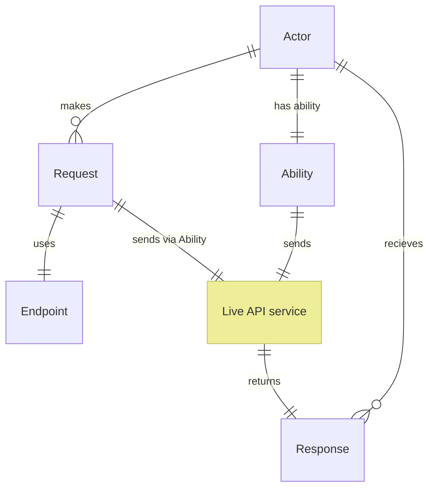

# CSF.Screenplay.WebApis Extension

The Web APIs Extension allows [Actors] to communicate with HTTP web API endpoints within a Screenplay [Performance].

## Overview

The diagram below shows how this extension works.
The concepts of the [Actor] and [Ability] (the ability is named [`MakeWebApiRequests`]) are explained in Screenplay's core documentation.
Other concepts are explained below.
Note that the **Live API service** in this diagram is not a part of Screenplay or this extension.
The Live API service represents an actual  HTTP(S) web server which hosts the API with which Screenplay is communicating.

[Actor]: xref:CSF.Screenplay.Actor
[Ability]: xref:AbilityGlossaryItem
[`MakeWebApiRequests`]: xref:CSF.Screenplay.WebApis.MakeWebApiRequests

## Endpoints

**Endpoints** are a fundamental, first class concept in this extension. An endpoint object is used to define: 

* The URL (route) at which the endpoint is found 
* Whether use of the endpoint requires any parameters
  * How many parameters
  * The .NET types of the parameter values
  * How those parameters are communicated to the endpoint 
* The endpoint's expected response/result type, if it is expected to return one

Users of this extension *are encouraged to build a library of endpoint objects*, describing the 'surface area' of the API that they wish to exercise.

[Actors]: xref:CSF.Screenplay.Actor
[Performance]: xref:CSF.Screenplay.IPerformance
[Actions]: ../../glossary/Action.md
[Questions]: ../../glossary/Question.md
