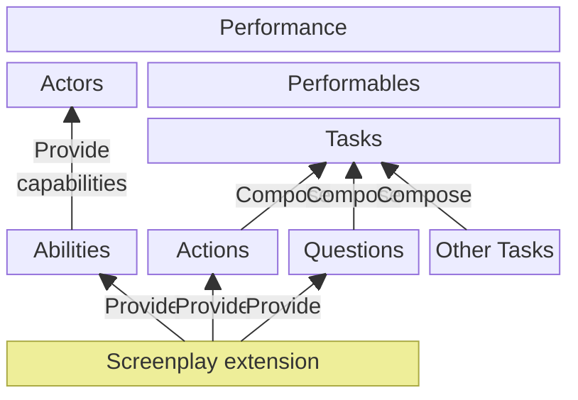

# Performances in more detail

[As noted in the previous article], a Performance is a scope (beginning and end) of some logic which is written using the Screenplay Framework.
A Screenplay may have as many Performances as it needs.

Let's revisit the diagram from the previous article, looking in more detail at the makeup of a **Performance**.
The diagram below omits the Screenplay and consuming logic.
On the other hand, it includes some concepts which were omitted from the previous diagram.

[As noted in the previous article]: index.md#performances

## The three kinds of performable

All performables will fall into one of three categories.
Recall that a performable is _a reusable piece of logic_.
In C# or VB.NET, each performable is a class.

* **Actions** are the smallest possible piece of logic to do something; they make a single, granular change
* **Questions** are the smallest possible piece of logic to query, get or read something; they do not change things
* **Tasks** are higher-level pieces of logic which are composed from any of Actions, Questions or other Tasks

Note that these three 'kinds' do not correspond directly to .NET types, such as interfaces.
By coincidence, there are three base interfaces for performables; _these do not correspond to Actions, Questions and Tasks_.

Actions and Questions are _usually provided by a Screenplay Extension_.
Most performables are Tasks; developers using Screenplay will write their own tasks, which make use of the Actions and Questions and compose them into pieces of logic which are relevant to their application.

## Abilities provide capabilities to Actors

Abilities are classes which provide capabilities to Actors who 'have' that ability.
Abilities are _usually provided by a Screenplay Extension_ and each typically enables the Actor to use Actions & Questions which interact with a specific technology.

An example of an ability is one named [`BrowseTheWeb`], which is provided by the **CSF.Screenplay.Selenium** extension.
The `BrowseTheWeb` ability grants the Actor the capability to make use of [a Selenium WebDriver], to control desktop web browsers from .NET code.

[`BrowseTheWeb`]: xref:CSF.Screenplay.Selenium.BrowseTheWeb
[a Selenium WebDriver]: https://www.selenium.dev/

## Screenplay extensions: Bundles of Abilities, Actions & Questions

This brings us along to what a Screenplay Extension is.
Each Extension provides a set of Abilities, Actions and Questions which deal with a specific technology.
Two examples are:

* **CSF.Screenplay.Selenium** - provides an ability to control desktop Web Browsers along with Actions & Questions representing each fine-grained interaction with the browser
* **CSF.Screenplay.WebApis** - provides an ability, actions and questions to make requests to web API endpoints

## Next: What's it like using Screenplay?

[Read page 3, where we take a deep dive into the code of two sample Performances](SamplePerformances.md).
