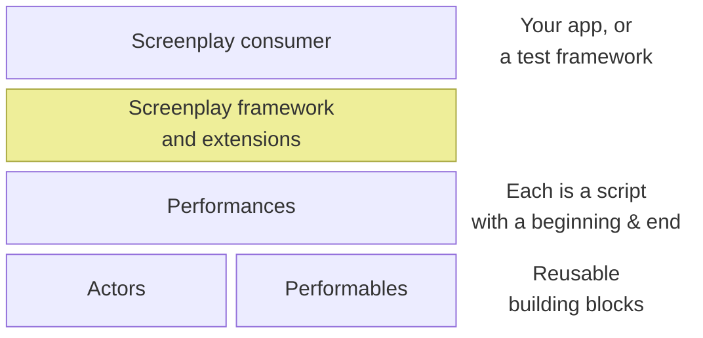

# Introduction to Screenplay

Screenplay is a software design pattern for scripting processes which are made from a series of steps, executed in order.
It is particularly useful when many of those steps have a lot in common, making them reuseable.
This has seen Screenplay become popular for writing the logic of [Behavior-driven development tests](https://en.wikipedia.org/wiki/Behavior-driven_development).
Despite this, _Screenplay is not limited to just testing logic_.

## How Screenplay fits into an architecture

This diagram provides a very high-level look at where Screenplay lies within the architecture of your software.

### The Screenplay consumer

The Screenplay consumer is _whatever software is using Screenplay_.
If you are using Screenplay for testing then this is likely a software testing framework such as [NUnit] or [Reqnroll] (formerly SpecFlow, [until it was discontinued]).
As noted above, Screenplay can be used by any .NET logic, not just testing frameworks.

[NUnit]: https://nunit.org/
[Reqnroll]: https://reqnroll.net/
[until it was discontinued]: https://reqnroll.net/news/2025/01/specflow-end-of-life-has-been-announced/

### Screenplay framework and extensions

The Screenplay framework is the library/NuGet package **[CSF.Screenplay]**.
This provides the 'engine' by which the Performances (below) may be executed.

Screenplay alone is just an extensible engine, it's not capable of very much on its own.
**Screenplay extensions** provide you with pre-written Performables.
Performables shipped with extensions are low-level building blocks which interact with a specific technology.
Once you have installed an extension, you may go on to write your own higher-level Performances, using those which are shipped with the extension.

[CSF.Screenplay]: https://www.nuget.org/packages/CSF.Screenplay

### Performances

A performance is a script; a multi-step process to follow, with a beginning and an end.
An app or test framework using Screenplay may have as many performances as it needs.
A performance should have a name which a non-developer can understand, so long as they are familiar with your software.
If you are using Screenplay as a BDD testing tool then each performance corresponds directly to one test scenario; the name of the performance is the name of the test.

### Actors

Screenplay logic, within each performance, is written from the perspective of Actors.
Actors often represent human users of your software, particularly when using Screenplay for testing.
An actor might also represent an automated process which is external to the software which Screenplay is controlling.

### Performables

Each performable is a reusable building block of .NET logic; a performable is _something that an actor may do_.
It's completely normal, encouraged even, for performables to be made-of (composed-from) other performables.
This way, writing a new performance which is a variation upon an existing performance benefits from maximum code-reuse, minimising code copy-pasting.

## Next: Introduction to Performances

[Read page 2 to learn more about the makeup of a Performance](Performances.md).
