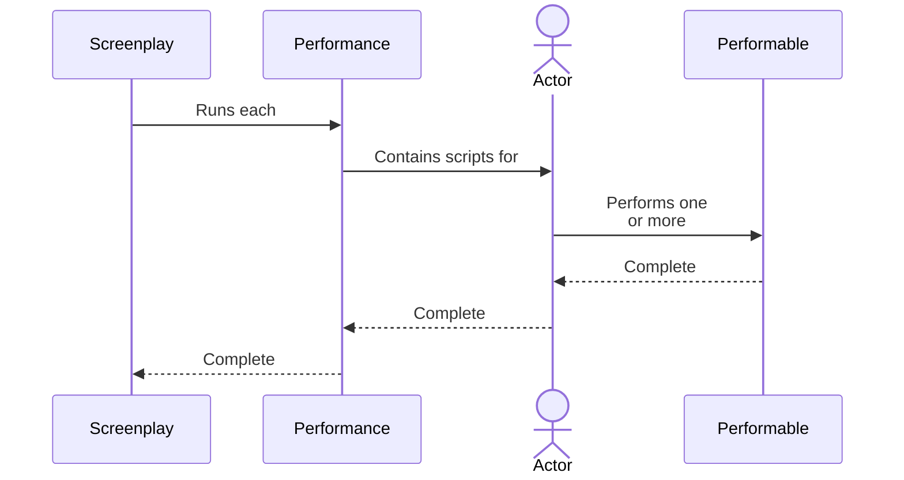

# Screenplay

A Screenplay, when used as a noun, refers to a complete execution of the Screenplay software.
A Screenplay is composed of at least one **[Performance]** and typically contains many performances.

In a testing framework, a Screenplay corresponds to a complete test run.

[Performance]: Performance.md

## Top-down look at a screenplay

The diagram below shows a top-down look at a Screenplay and how it relates to [Performances], [Actors] and [Performables].
The Screenplay _might itself be controlled by_ a [Test Integration], if Screenplay is being used for automated tests.

[Performances]:Performance.md
[Actors]: Actor.md
[Performables]: Performable.md
[Test Integration]: Integration.md
